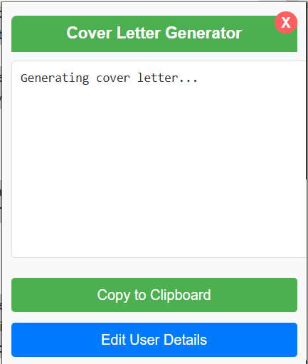
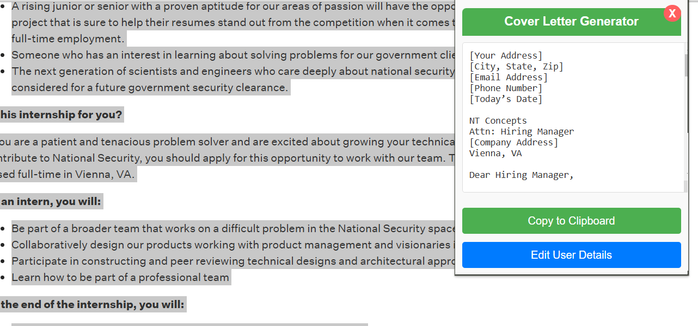

# Cover Letter Generator Extension

Effortlessly generate professional, tailored cover letters directly from job descriptions!

---

## 📖 Overview

The **Cover Letter Generator** Chrome Extension is a productivity tool designed to simplify the process of creating personalized cover letters. With just a few clicks, it generates high-quality, tailored cover letters by leveraging AI technology. It's a must-have for job seekers looking to save time and enhance the quality of their applications.

---

## 🚀 Features

- **AI-Powered Cover Letter Generation**:

  - Automatically generates a professional cover letter based on a highlighted job description and your saved profile details.

- **User Profile Management**:

  - Save your personal details (name, experience, skills, education, projects, achievements) for quick and consistent cover letter generation.

- **Real-Time Validation**:

  - Ensures the selected text is a valid job description before processing.

- **Copy to Clipboard**:

  - Quickly copy the generated cover letter with a single click.

- **Seamless Integration**:

  - Works on any website where text can be selected, including LinkedIn, job boards, and career portals.

- **User-Friendly Interface**:

  - Intuitive design for easy navigation and customization.

---

## 🛠️ Tech Stack

- **JavaScript**: Chrome Extension APIs
- **OpenAI API**: For intelligent text generation
- **HTML/CSS**: For user interface
- **Chrome Storage**: To save user profile details locally

---

## 🔧 Installation

1.  Clone the repository:

    `git clone https://github.com/your-username/cover-letter-generator-extension.git`

2.  Navigate to the project directory:

    `cd cover-letter-generator-extension`

3.  Open Chrome and go to `chrome://extensions/`.
4.  Enable **Developer Mode** (toggle in the top-right corner).
5.  Click **Load unpacked** and select the project folder.
6.  The extension will now appear in your browser's extensions bar!

---

## 🖥️ How to Use

1.  Highlight a job description on any webpage.
2.  Right-click and select **"Generate Cover Letter"** from the context menu.
3.  A popup will appear with your personalized cover letter.
4.  Review the cover letter, copy it, or update your user details via the **Settings** page.

---

## 📷 Screenshots

---

## 🔒 Privacy Policy

Your data is stored locally on your browser and is not shared with any third-party servers, except for securely transmitting input to OpenAI for generating the cover letter. No sensitive or personally identifiable information is permanently stored outside your local system.

---

## 💡 Future Enhancements

- Add multi-language support.
- Include customizable templates for different job types.
- Export generated cover letters directly as `.pdf` or `.docx` files.

---

## 🤝 Contributing

Contributions are welcome! Feel free to fork this repository and submit a pull request with your improvements.

---

## 📫 Contact

Have questions or feedback? Feel free to reach out:

- **Email**: bellapukondaveerendra@gmail.com
- **LinkedIn**: https://www.linkedin.com/in/veerendra-bellapukonda-3a1245235/
